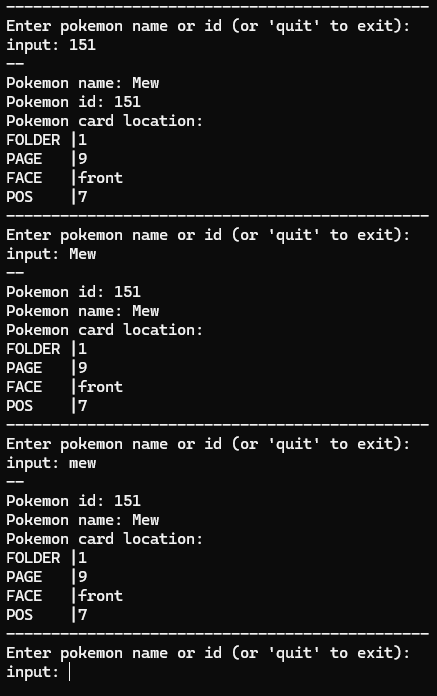

# Pokemon Folder Organizer
Program to find out where a card should go to collect Pokedex from gen 1 to 5 

Enter a Pokemon name or ID and you'll get the pokemon's location in your binder. 

## Description
Program to find out where a card should go to collect Pokedex from gen 1 to 5 for use with 3x3 binders (9 slots per side) with 20 pages inside  
I personnal use 2 binders to store all the 649 pokemon (gen 1 to 5). *the reason for the 'folder' data* 

### Technical
Console application write in **C++ 20** with **Visual Studio 2022** 

## Data Used
Pokedex recover from [Fanzeyi](https://github.com/fanzeyi/pokemon.json/blob/master/pokedex.json) 
Only french pokemon name is parse (you can change it in the *JsonReader.cpp* file) 
The Json used for the pokedex only goes up to the 8th generation. 

## TODO LIST
- Use a clean json parser
- Change the database to a complete one (with all pokemons)
- Add a visual display for the position

## Credit
- Vincent DEVINE
- [Fanzeyi](https://github.com/fanzeyi) *for the database used*