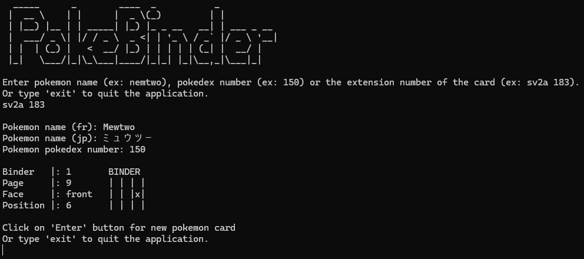

# PokeBinder

**PokeBinder** is a C++ console application designed to assist collectors in organizing their Pokémon cards in **Natianal Pokémon order**

## Features
- **Scope:** Covers **Generation 1 through generation 5**.
- **Smart Layout:**
    - Automatically starts a new page for each new generation
    - Includes specific edge-case handling for **Victini** (placed at the end of the Gen 5)
- **Binder Configuration:** Optimized for a setup of **two 360-pocket binders** (Standard 9-cards, double sided).
- **Detailed Output:** Retrieves the Pokémon's French and Japanese names, National ID and the precise location (binder, page, front/back, location).

## Input Methods
The application supports 3 types of user inputs:
1. **Pokémon french name** *(mewtwo)*
2. **National Pokédex Number** *(150)*
3. **Set Card Number** *(sv2a 183)*

Exclusive support for **Japanese TCG sets**

## Supported Sets
- **Mega Evolution**
    - m1l, m1s, m2, m2a, m3  
- **Scarlet & Violet**
    - sv1s, sv1v, sv1a, sv2p, sv2d, sv2a, sv3, sv3a, sv4k, sv4m, sv4a, sv5k, sv5m, sv5a, sv6, sv6a, sv7, sv7a, sv8, sv8a, sv9, sv9a, sv10, sv11b, sv11w
- **Sword & Shield Era**
    - s1w, s1h, s1a, s2, s2a, s3, s3a, s4, s4a, s5i, s5r, s5a, s6h, s6k, s6a, s7d, s7r, s8, s8a, s9, s9a, s10d, s10p, s10a, s10b, s11, s11a, s12, s12a

## Technology
- Language: **C++** *23*
- JSON Parsing: [**json by nlohmann**](https://github.com/nlohmann/json/tree/v3.12.0?tab=readme-ov-file) *3.12.0*
- Logger: [**OMLogger by Vincent DEVINE**](https://github.com/Vincent-Devine/OMLogger/tree/v2.2.0) *2.2.0*

The [dataset](./PokeBinder/Asset/) used in this project was generated with the assistance of Google's Gemini AI.

## Credit
- [Vincent DEVINE](https://github.com/Vincent-Devine)